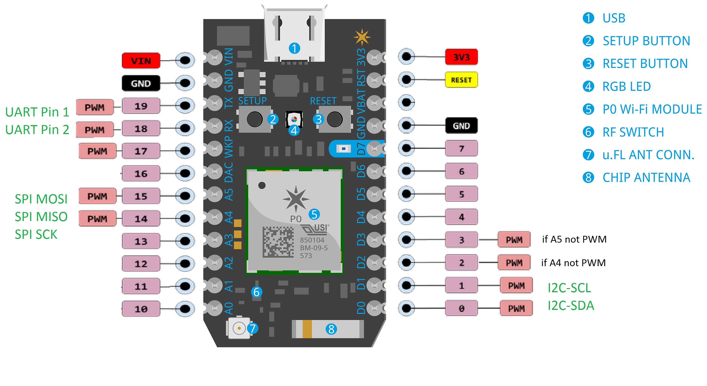

# Microcontrollers Intro

## About

The particle photon is an inexpensive wifi-enabled micro-controller that comes with a well-developed & secure cloud service for remote programming, device control and data collection. The names are a bit silly but these little micro-controller pack a lot of punch and program just like an Arduino. The newest versions of the photon (particle electron, particle boron, particle xenon) make it super easy to move everything to a cellular network for field deployment (within 2G, 3G or LTE range) or implement a mesh network of microcontrollers.

## Technical Specs

- detailed [technical specs](https://docs.particle.io/datasheets/photon-%28wifi%29/photon-datasheet/)
- detailed [pin and button defintions](https://docs.particle.io/datasheets/photon-%28wifi%29/photon-datasheet/#pin-and-button-definition)
- overview schematic of key functionality we'll explore
  
  - `UART` = universal asynchronous receiver/transmitter
  - `I2C` = inter integrated circuit
  - `SPI` = serial peripheral interface
  - `PMW` = pulse width modulation

## Prerequisites

- create a free account at [particle.io](https://login.particle.io/signup?redirect=https%3A%2F%2Fwww.particle.io%2F) (cloud service for remote microcontrollers)
- install the [Particle Command Line Interface (CLI)](https://docs.particle.io/guide/tools-and-features/cli/photon/#installing)
- install the [Particle Development Environment (IDE)](https://docs.particle.io/guide/tools-and-features/dev/)
- optional but useful: install the Particle App on your phone ([iPhone](https://itunes.apple.com/us/app/particle-build-iot-projects-wifi-or-cellular/id991459054?mt=8), [Android](https://play.google.com/store/apps/details?id=io.particle.android.app), [Windows](https://www.microsoft.com/en-us/store/p/particle/9nblggh4p55n))

Note: technically you only need the CLI and can do everything from command line with a regular text editor but the IDE has some very useful features that makes your life easier.

## Claim your photon

Connect to your photon and setup up the wireless. Note that all course photons have been white-listed with OIT in advance so you can use them on the regular `UCB Wirless` network without a network password. Also note that you can only claim/setup a photon if it is not already claimed (i.e. associated with another account) for security reasons, and if it is in listening mode (blinking dark blue).

- via CLI (from terminal):
  - `particle login` (if you are not already logged in)
  - `particle setup` (follow steps)
  - once it says *Attempting to verify the Photon's connection to the cloud...*, reconnect your computer to the UCB Wireless network (it may reconnect automatically on some operating systems but not all)
- alternatively, [via smartphone](https://docs.particle.io/guide/getting-started/start/photon/#step-2b-connect-your-photon-to-the-internet-using-your-smartphone)
- Note: the [web setup](https://setup.particle.io/) does not work with UCB Wireless

## Test your photon

- make sure the device is listed if you run `particle list` in your terminal with function names `digitalread`, `digitalwrite`, `analogread`, `analogwrite` (these are installed from the default program running on the particle photon called tinker)
- run `particle call NAME digitalwrite D7,HIGH` replacing `NAME` with the name you gave your device
- likewise, run `particle call NAME digitalwrite D7,LOW`
- Note: you can do the same from the Particle App on your smartphone

## Create a project

- clone this repository to your computer, then open the repo folder with the Particle IDE or your favorite text editor
- the easiest way to create a project is to hit the **Start new project** button in the Particle IDE and accept the suggested defaults (i.e. create a project in the repo location)
  - alternatively, from the terminal in your repo folder, run `particle project create .. --name REPO` from the command line, where REPO is the name of your repo folder
- take a look at the created folder to figure out its structure
- in the new `src/???.ino` file, add the following code:
  - in the **setup** function:
  ```C++
  pinMode(D7, OUTPUT);
  ```
  - in the **loop** function:
  ```C++
  digitalWrite(D7, HIGH);
  delay(1000);
  digitalWrite(D7, LOW);
  delay(1000);
  ```

## Compile & Flash a program

- compile your program in the cloud:
  - easiest is to select your target device with the **cross hairs button** and then push the **cloud** button in the Particle IDE (Cmd+R)
  - alternatively, run `particle compile photon` from the terminal
  - if compile is successful, this creates a `photon_xxxxx.bin` file that is represent your program, otherwise you'll get a list of errors that should help trouble-shoot your code
  - Note: this compilation happens in the particle cloud which has the advantage that it uses standard compiler setup. If you really want to compile locally on your own computer, [follow these instructions](https://docs.particle.io/faq/particle-tools/local-build/photon/)
- flash your program to the device:
  - easiest is to push the **lightning** button in the Particle IDE (Cmd+U)
  - alternatively, run `particle flash NAME photon_xxxxx.bin` from the terminal with the NAME of your device and the name of the `.bin` file
- compile & flash in one step (if compile is successful)
  - this is the default of the **lightning** button if there isn't already a `.bin` file
  - from the terminal: `particle flash NAME`, i.e. flash without specifying a `.bin` file

## Exercise #1: Serial output

While your photon can run on its own away from your computer and you can flash code via the internet, it can be extremely helpful to have it also send some regular debugging information via the USB cable to your computer during program development. This of course only works if it is actually connected to your computer via USB.

- modify your blinking program as follows:
  - in the **setup** function:
  ```C++
  Serial.begin(9600);
  pinMode(D7, OUTPUT);
  Serial.println("INFO: setup complete");
  ```
  - in the **loop** function:
  ```C++
  Serial.println("ON at " + Time.timeStr());
  digitalWrite(D7, HIGH);
  delay(1000);

  Serial.println("OFF at " + Time.timeStr());
  digitalWrite(D7, LOW);
  delay(1000);
  ```
- compile & flash the new program
- start your serial monitor with the **Show Serial Monitor** button in the Particle IDE and hit **Connect**
- alternatively, run `particle serial monitor` from the terminal
- Note: you will notice that the serial monitor gets disconnected whenever you flash new code to your device, if you find it annoying to reconnect manually, you can run the following from the terminal: `while true; do particle serial monitor; done` (hit ctrl+C twice quickly to exit, this may not work on Windows)

## Exercise #2: Reading analog data


## Exercise #3: Reacting to analog data


## Exercise #4: Logging data


## Miscellaneous Information

### How to add library

- use the **Browse and manage Particle libraries** button to search for libraries of interest and add them to your project
- alternatively:
  - search for a library in the terminal, e.g. `particle library search LiquidCrystal`
  - add a library in the terminal `particle library add LiquidCrystal_I2C_Spark`
- check your `project.properties` file to see all dependencies
- add include statement to your `.ino` file, e.g. `#include "LiquidCrystal_I2C_Spark.h"`
- Note: to include a local copy of the source code of a library (e.g. for extension or other modifications), use the following command: `particle library copy LiquidCrystal_I2C_Spark` which will add it to the `lib` folder. This can be useful even just to look at the code or the examples that are usually provided with any library and you can remove the library simply by deleting the entire library folder (or the line in `project.properties` if using a remote copy).


### How to register a new photon with OIT

- find out your device's **MAC Address** (i.e. network ID) by following [these instructions](https://docs.particle.io/support/troubleshooting/troubleshooting-tools/photon/)
- write down the mac address (good to keep these in a file), it should have the form `1a:2b:34:5c:6d:78`
- send OIT (email: help@colorad.edu) an email along these lines:
 > Dear OIT, I am working with wireless micro-controllers for my project on XXXXX and would like to add a new device. Could you add the following MAC address for the new wifi-enabled micro controller (a particle photon with ARM Cortex M3 micro-controller and a Broadcom Wi-Fi chip) to the UCB Wireless network? My CU Boulder identikey is xxxxxxx.

 > 1a:2b:34:5c:6d:78

- they will usually honor your request within a few days but you might have to renew the registration once a year with a similar email (you can send them many MAC addresses at once)


### Errors

- **Error codes**: the devices modes page has an extremely useful list of color error codes: https://docs.particle.io/guide/getting-started/modes/photon/

- **Flashed code that causes trouble**: put photon into safe mode (i.e. connected to particle cloud but not running program) so you can flash it again. To get into safe mode: Hold down BOTH buttons, release only the RESET button, while holding down the SETUP button, wait for the LED to start blinking magenta, release the SETUP button.

- **Doesn't take any commands / trouble claiming the photon**: make sure to start from scratch, photon might have gotten corrupted and need to be factory reset, just hold both the setup and reset button pressed until it starts going through series of LED colors and ends on white, then let go. Reinstall vis USB or phone Partcle app.

- **Wrong server keys**: sometimes internet connectivity issues are because of wrong server keys, to update get into DFU mode (see below) and then run `particle keys server` on the command line

- **Fails to update properly**: one of the first things after installation is a firmware update. This usually happens via the wireless after setup but if there is any trouble with the internet connection or something else during the update process, this might not work well. Here's an easy way to do the [firmware upgrade via USB](https://docs.particle.io/support/troubleshooting/firmware-upgrades/photon/) (on Mac):
  - Install `dfu-util` via [mac ports](https://www.macports.org/) or [homebrew](http://brew.sh/) by running `sudo port install dfu-util` or `sudo brew install dfu-util`
  - While connected via USB, enter [dfu mode](https://docs.particle.io/guide/getting-started/modes/photon/#dfu-mode-device-firmware-upgrade-) on the photon by holding both **RESET** and **SETUP**, releasing only **RESET** and waiting for yellow flashing (first flashes magenta) then also release **SETUP**
  - run `particle update` from command line
